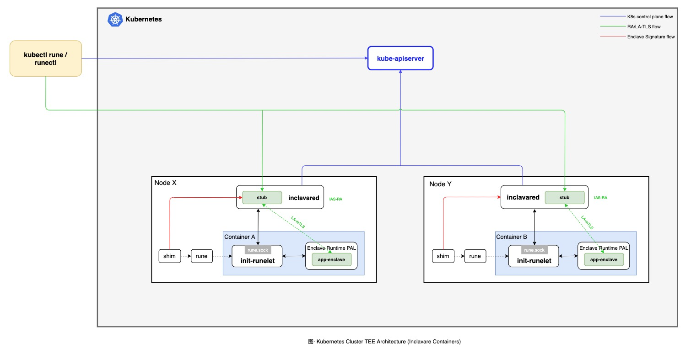

# Inclavared

## Introduction

Inclavared is a coordinator which creates a m-TLS(Mutal Transport Layer Security) connection between stub enclave and 
other enclaves with remote attestation (aka "[RA-TLS](https://raw.githubusercontent.com/cloud-security-research/sgx-ra-tls/master/whitepaper.pdf)").

## Design



## Installation

TODO

## Build Source Code

### Requirements

* rust-lang

### Setup Environment

```bash
cargo install protobuf
cargo install bindgen

# Linux(Centos/RHEL)
yum install -y clang-libs  clang-devel

# MacOS
brew install clang

git clone https://github.com/alibaba/inclavare-containers.git
cd inclavare-containers/
export ROOT_DIR=`pwd`

```

### Based On Enclave-TLS

You can refer to [this guide](https://github.com/alibaba/inclavare-containers/tree/master/enclave-tls#building) to build and install Enclave-TLS, and then

```shell
export LD_LIBRARY_PATH=$LD_LIBRARY_PATH:/opt/enclave-tls/lib
```

#### Build

* inclavared

```bash
cd ${ROOT_DIR}/inclavared/
make
```

#### Run

Inclavared supports tcp socket and unix socket at the same time, and sockaddr can be an address form similar to `127.0.0.1:1234` or `/path/to/unixsock.sock`.

* Run as server

```bash
${ROOT_DIR}/inclavared/bin/inclavared --listen <sockaddr>
```

* Xfer data between client and server

recv data from sockaddr1 and send to sockaddr2, and recv data from sockaddr2 and send to sockaddr1

```bash
${ROOT_DIR}/inclavared/bin/inclavared --listen <sockaddr1> --xfer <sockaddr2>
```

* Run as client

```bash
${ROOT_DIR}/inclavared/bin/inclavared --connect <sockaddr>
```
